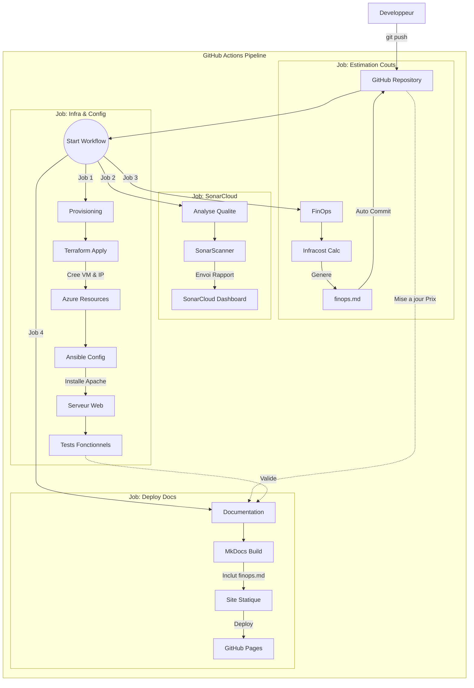

#  TP DevSecOps - Infrastructure Azure

Bienvenue sur la documentation technique de notre projet d'infrastructure.
Ce site est généré automatiquement via **GitHub Actions** et hébergé sur **GitHub Pages**.

---

##  Vue d'ensemble
Ce projet implémente une approche **DevSecOps** complète pour déployer une application Web sécurisée sur Microsoft Azure.

###  Stack Technique
| Domaine | Outil utilisé | Rôle |
| :--- | :--- | :--- |
| **Infrastructure as Code** |  **Terraform** | Déploiement de la VM, Réseau, Disques |
| **Configuration** |  **Ansible** | Installation et sécurisation d'Apache |
| **CI/CD** |  **GitHub Actions** | Orchestration de tous les jobs |
| **Qualité & Sécurité** |  **SonarCloud** + **tfsec** | Analyse statique code & infra (SAST/IaC) |
| **FinOps** |  **Infracost** | Estimation des coûts avant déploiement |
| **Identité** |  **Managed Identity** | Authentification Azure sans secrets |

##  Notre Workflow CI/CD

Chaque modification du code (`git push`) déclenche un pipeline automatisé composé de 4 jobs parallèles :

1.  **Infrastructure & Config** : Provisioning Terraform et configuration Ansible.
2.  **Qualité & Sécurité** : Analyse SonarCloud et Scan IaC (`tfsec`).
3.  **FinOps** : Estimation du coût mensuel avec Infracost.
4.  **Documentation** : Génération et déploiement du site MkDocs.

---

